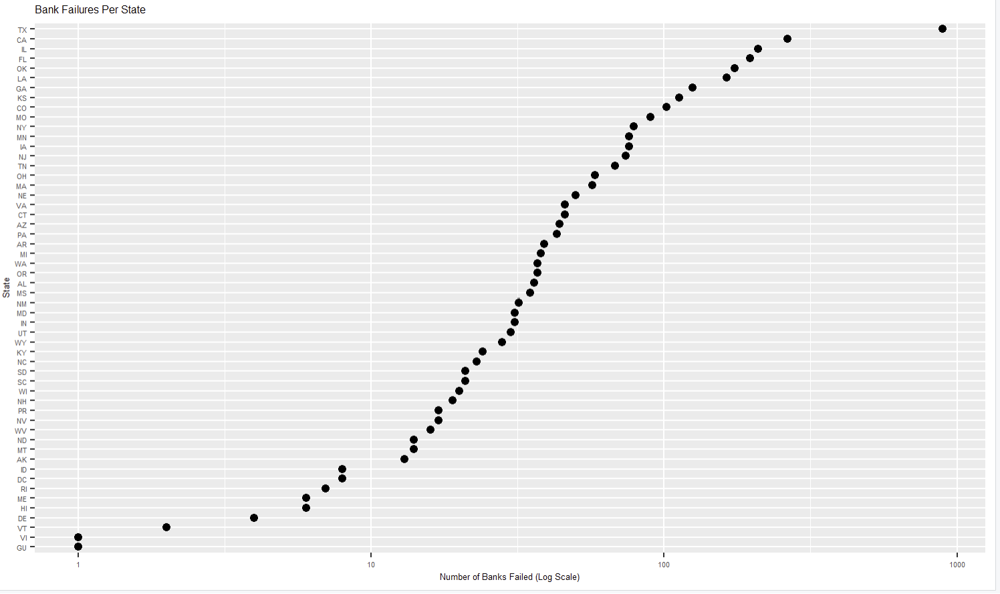
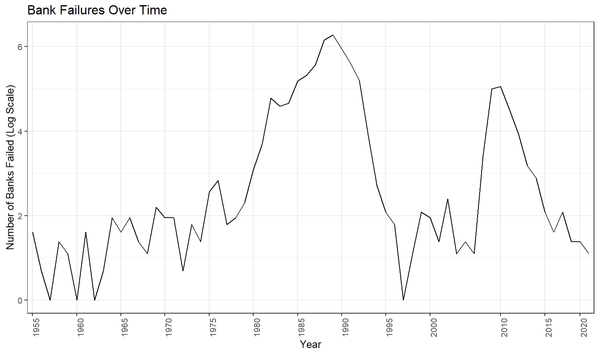
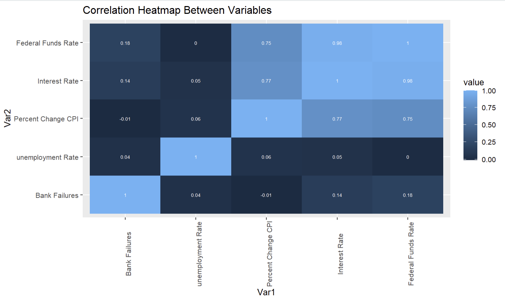

```{r setup, include=FALSE}
knitr::opts_chunk$set(echo = TRUE)
```
**I. Introduction**

Topic: What are the macroeconomic conditions when a bank fails.

Why it matters: It is important to see what the macroeconomic conditions are when a bank fails. This will allow for you to have an idea of what happens to the conditions when the bank does fail. This is not a guarantee that a bank will fail but it will allow for you to have a better idea of what could happen when these conditions can be found. 

Data: We pulled data from two different sources. This allowed for us to get a more broad range of data

Bank Failure data: https://banks.data.fdic.gov/bankfind-suite/failures

  - Name
  
  - Location
  
  - Date
  
  - Costs and assets 
  
Economic Indicators data: https://fred.stlouisfed.org/graph/?g=3obN#0

  - Unemployment rate
  
  - CPI
  
  - Discount rate 
  
  - Real GDP. 

The economic factors are monthly, GDP is quarterly and the bank failures just happen when the bank failed. The data that we have spans from 1948 til now. The data sets are related to each other because they both have to deal with the financial markets. They will both have an impact on the other. All of the macroeconomic indicators data is in percentages and the Bank data is either categorical or there’s numbers that will either be the ID of the bank or in dollars to show the assets that the bank lost. 


**II. Data Processing**

In order to make the data that we had more meaningful we did a few things such as merging based on the years, changing the column names,and removing all of the rows that didn’t have all of the macroeconomic data. In order to have one data set instead of two different data sets, we merged based on the years. This allows for everything to be in one row, all of the needed information for when that bank failed would be together. We had problems because there was more than one bank that failed each year in some cases so we merged based on the month and year that the bank failed. In order to fix this we took of the day in the dates and then merged. This allowed for the macroeconomic data to go to the correct banks by the month and year. By renaming all of the column names it allowed for not only us but everyone else who looks at our work to be able to easily know what all of the columns mean. The last thing that we did to make sure that we had a good data set that we can use is that we took out all of the rows that didn’t have all of the macroeconomic data. The points that didn’t have all of the data wasn’t going to be useful in the analysis because we are looking at how all of the different macroeconomic factors change when a bank fails. 

To ensure thorough data cleaning, we meticulously followed a structured data cleaning checklist. The initial data set was sourced from Excel and read into R. Subsequently, we removed columns that offered little relevance for our deeper analysis.

We took the time to understand the meaning of each variable, which will be discussed in later sections. As the data originated from official government sources, it arrived complete and devoid of any missing entries. 

As we brought everything together, we made sure to switch the important columns to dates and numbers. Also, when we looked at the text-based info, we thought it would be helpful to split up the state and city names. This way, we could easily check how many banks failed in each state.

Looking further into the bank data we looked at everything that could be found in the different columns. There's 4 different categorical columns in the data set, they are the Insurance fund, character type, the transaction type, and the resolution. In the insurance fund there's bank insurance fund (BIF), resolution trust corporation (RTC), federal savings and loan insurance (FSLIC), savings association insurance fund (SAIF), deposit insurance fund (DIF) and FDIC. Within the character type there's national member banks (N), state member banks(SM), state nonmember banks(NM), savings associations (SA) and saving banks and savings and loans (SB). In the transaction types there's assistance transactions (A/A), reprivatization (REP), purchase and assumptions (P&A), purchase and assumptions (PA), purchase and assumption (PI), insured deposit transfer (IDT), consignment program institution (MGR) and payout. In the resolution column it will tell you if the bank failed or if there was assistance meaning that the bank was bailed out. This allows for us to have a better idea of what the bank failure looked like, not every bank failed in the same way and some of the banks that did fail got bailed out.  

The data that we got from the FRED is more intuitive, we changed everything to be a percent which makes looking at the macroeconomic data easier to understand. We wanted to try and get the most broad idea of the market. We felt like these different indicators gave us the best idea to what the market looked like at the national level. 


**III. Transformations**

In order to keep the results easier to understand we decided to not do any transformations. This allows for anyone to look at the graphs and the data and have an idea of what it is telling you. It would be hard to intuitively look at a graph that has the log of an interest rate and know what it is telling you. The only time that we would transform the data would be if we needed it for a graph to show the relationship better. This was a tool that we tried to limit the amount of times that we used.

This missing data was talked about earlier, this was dealt with by taking out the rows that didn’t have everything that was needed to complete the analysis. There was also no extreme values that we had to take care of. 


**IV. Findings and visualizations**



This graph was used to see if there was any relationship between the banks that failed and the states that the banks failed in. This will give us a better idea of what the banks that's failed in each of the states. We took the log to show the data in a more meaningful way. The data that was not log transformed didn’t allow for us to find a meaningful relationship. 




We wanted to see if there was a time where more banks failed so we wanted to plot the data in a way that shows the number of banks over the time. This will allow for us to see if there is a certain time period that we should be looking into closer. Once again the number of banks that failed is in a log scale. 


By looking at the correlation plots this allows us to look at how all of the other variables affect each other. The lighter the box is the more correlated that the variables are with each other. This will allow for us to get a better idea of what macroeconomic factors we should be looking at closer. 

